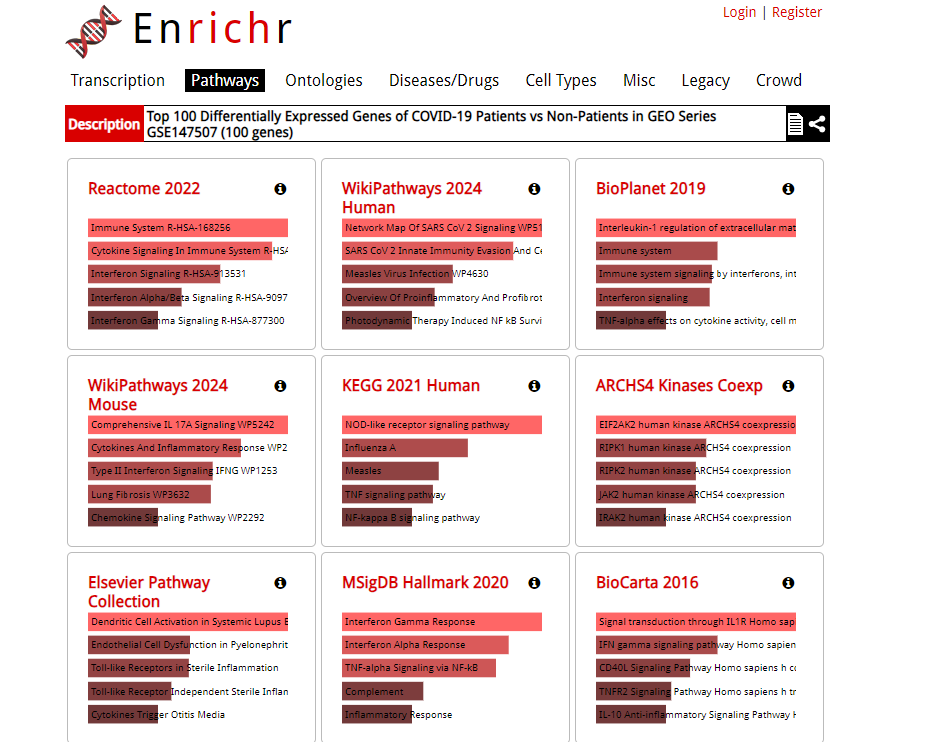
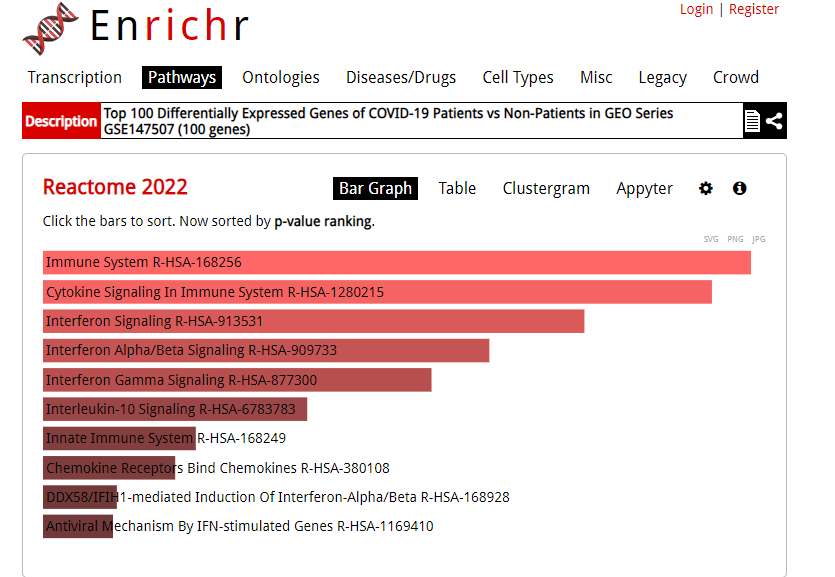
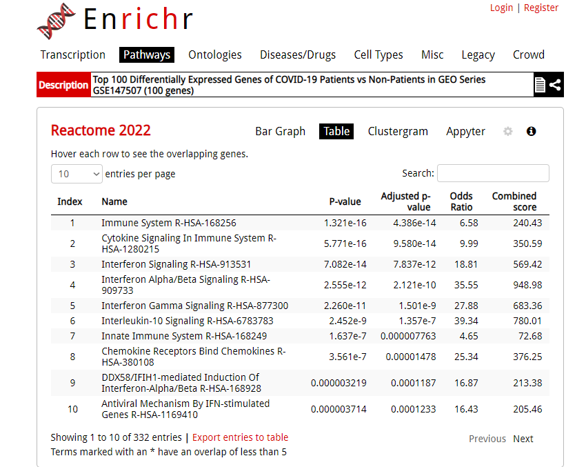

# covid19-gene-expression-analysis

Utilizing [GEO Series GSE147507](https://www.ncbi.nlm.nih.gov/geo/query/acc.cgi?acc=GSE147507), the main objective of `covid19-gene-expression-analysis` is to analyze and represent the top 100 differentially expressed genes in COVID-19 patients vs. non COVID-19 patients as a heat map and volcano plot. During the progression of a COVID-19 infection, patients' immune responses become dysregulated. A "cytokine storm" phenomenon occurs through an uncontrolled production of large amounts of cytokines - inflammatory signaling proteins. This elevated activity can have serious repercussions such as organ failure and tissue damage. Observed inhibition of the "cytokine storm", as well as reduction of these protein concentrations, lead to more effective treatment. 

In addition, many genes expressed can have overlap with other diseases, allowing scientists to identify risk severity for secondary diseases or symptomatic complications. In the case of COVID-19, it is understood that older ages pose a significantly higher risk of developing COVID pneumonia, and in the most severe cases, ARDS (acute respiratory distress syndrome).

# GEO Series GSE147507

For the scope of this project, only samples of A549 (human lung epithelial cell lines) treated and untreated with SARS-CoV-2 were used for the differential analysis. 

## Table of Contents

- [Features](#features)
- [Prerequisites](#prerequisites)
- [Installation](#installation)
- [Results](#results)
- [Roadmap](#roadmap)
- [License](#license)

## Features
TBD

## Requirements
- Pipenv
- GEOparse
- matplotlib
- pandas
- seaborn
- pyDESeq2
- DESeq2
- R

## Installation

TBD

## Results

### Pathway Enrichment

Performing pathway enrichment is crucial for researchers to gain insight on the underlying mechanisms of biological processes, disease state, or experimental condition from a gene list. It can assist in identifying and prioritizing candidate disease genes and provide a deeper understanding of disease pathology.

The top 100 differentially expressed genes concluded through differential analysis was inputted into [Enrichr](https://maayanlab.cloud/Enrichr/), a web-based tool that analyzes gene lists and returns annotated gene sets based on existing biological knowledge. The scope of this project focused on the resulting enriched pathway bar graphs generated found [here](https://maayanlab.cloud/Enrichr/enrich?dataset=6f16781ba02a347cd3ab1fbd14f39140).

Each bar graph corresponded to a specific database or gene set library queried by Enrichr to provide a comprehensive overview. Enrichr analyzed provided gene list against multiple libraries to identify overlapping biological themes. This process highlighted potential molecular signatures of COVID-19 and indicated which cellular mechanisms might be disrupted or activated. The degree of enrichment is measured by the combined score of p-value and z-score and displayed by the length of each bar. 

Example of pathway bar graph and table from the generated results:

## Roadmap
TBD!

## References
[What Is Currently Known about the Role of CXCL10 in SARS-CoV-2 Infection?](https://pmc.ncbi.nlm.nih.gov/articles/PMC8998241/)

[GSE147507 Human Gene Raw Read Counts](https://www.ncbi.nlm.nih.gov/geo/download/?acc=GSE147507)
(Data from 'GSE147507_RawReadCounts_Human.tsv.gz' file.)

[Enrichr](https://maayanlab.cloud/Enrichr/)

## License
[Apache 2.0](https://choosealicense.com/licenses/apache-2.0/)